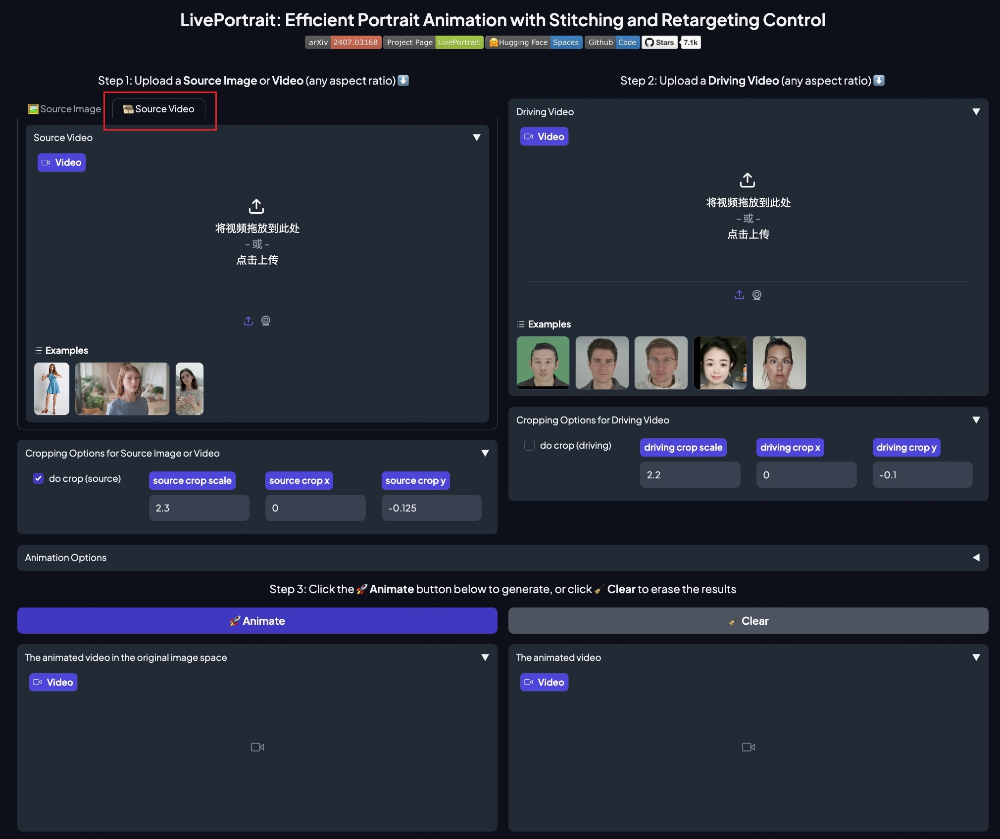

## 2024/07/19

**Once again, we would like to express our heartfelt gratitude for your love, attention, and support for LivePortrait! 🎉**
We are excited to announce the release of an implementation of Portrait Video Editing (aka v2v) today! Special thanks to the hard work of the LivePortrait team: [Dingyun Zhang](https://github.com/Mystery099), [Zhizhou Zhong](https://github.com/zzzweakman), and [Jianzhu Guo](https://github.com/cleardusk).

### Updates

- <strong>Portrait video editing (v2v):</strong> Implemented a version of Portrait Video Editing (aka v2v). Ensure you have `pykalman` package installed, which has been added in [`requirements_base.txt`](../../../requirements_base.txt). You can specify the source video using the `-s` or `--source` option,  adjust the temporal smoothness of motion with `--driving_smooth_observation_variance`, enable head pose motion transfer with `--flag_video_editing_head_rotation`, and ensure the eye-open scalar of each source frame matches the first source frame before animation with`--flag_source_video_eye_retargeting`.

- <strong>More options in Gradio:</strong> We have upgraded the Gradio interface and added more options. These include `Cropping Options for Source Image or Video` and `Cropping Options for Driving Video`, providing greater flexibility and control.

  
   
  The Gradio Interface for LivePortrait

### Community Contributions

- **ONNX/TensorRT Versions of LivePortrait:** Explore optimized versions of LivePortrait for faster performance:
  - [FasterLivePortrait](https://github.com/warmshao/FasterLivePortrait) by [warmshao](https://github.com/warmshao) ([#150](https://github.com/KwaiVGI/LivePortrait/issues/150))
  - [Efficient-Live-Portrait](https://github.com/aihacker111/Efficient-Live-Portrait) by [aihacker111](https://github.com/aihacker111/Efficient-Live-Portrait) ([#126](https://github.com/KwaiVGI/LivePortrait/issues/126), [#142](https://github.com/KwaiVGI/LivePortrait/issues/142))
- **LivePortrait with [X-Pose](https://github.com/IDEA-Research/X-Pose) Detection:** Check out [LivePortrait](https://github.com/ShiJiaying/LivePortrait) by [ShiJiaying](https://github.com/ShiJiaying) for enhanced detection capabilities using X-pose, see [#119](https://github.com/KwaiVGI/LivePortrait/issues/119).
