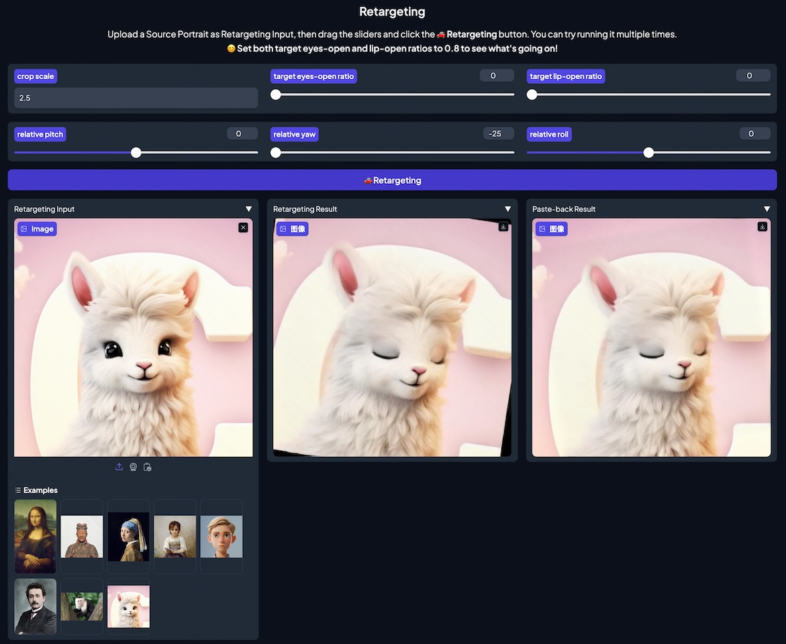

### Updates

- **Portrait pose editing:** You can change the `relative pitch`, `relative yaw`, and `relative roll` in the Gradio interface to adjust the pose of the source portrait.
- **Detection threshold:** We have added a `--det_thresh` argument with a default value of 0.15 to increase recall, meaning more types of faces (e.g., monkeys, human-like) will be detected.You can set it to other values, e.g., 0.5, by using `python app.py --det_thresh 0.5`.

  
   
  Pose Editing in the Gradio Interface

