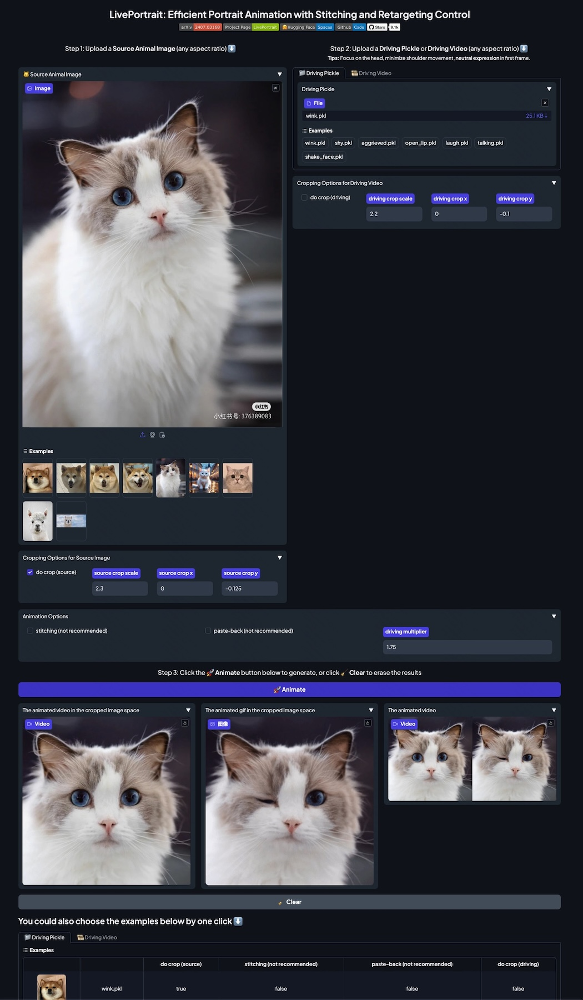
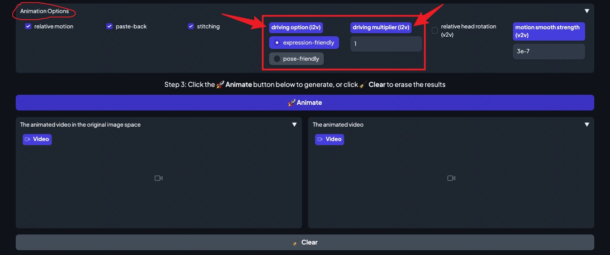
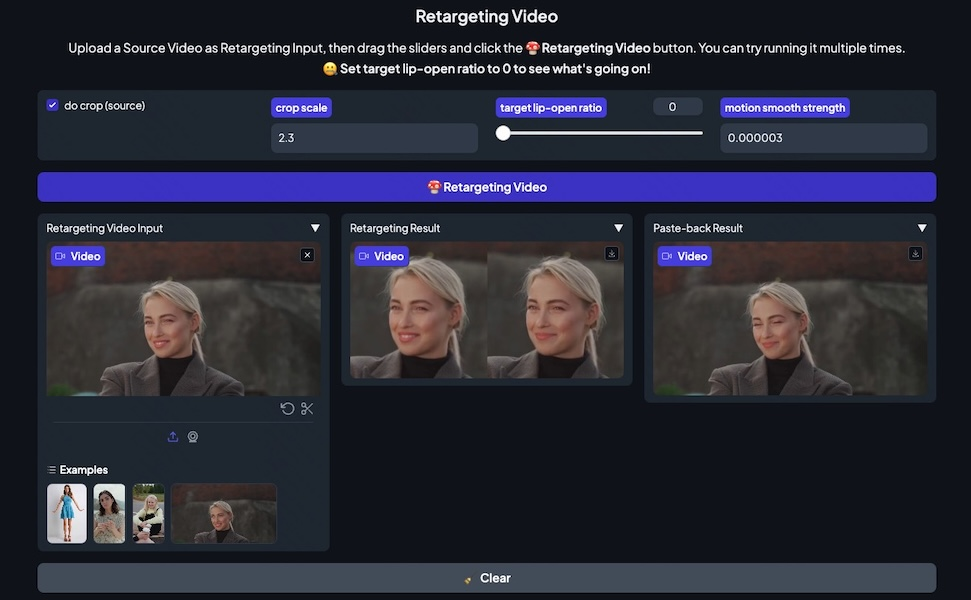

## 2024/08/02

<p align="center">
  <video id="animal-monkey-dance-video" controls muted playsinline width="60%">
    <source src="https://github.com/user-attachments/assets/d5473d7e-cce9-4a26-b6ad-96194e5c659d
    " type="video/mp4">
  </video>
</p>

🎉 We are excited to announce the release of a new version featuring animals mode, along with several other updates. Special thanks to the dedicated efforts of the LivePortrait team. 💪

### Updates on Animals mode
We are pleased to announce the release of the animals mode, which is fine-tuned on approximately 20K frames of various animals (mostly cats and dogs). The trained weights have been updated in [HuggingFace](https://huggingface.co/KwaiVGI/LivePortrait/tree/main/liveportrait_animals). There are two ways to run this mode.

Please note that we have not trained the stitching and retargeting modules for the animals model due to several technical issues. This may be addressed in future updates. Therefore, we recommend using the `--no_flag_stitching` option when running the model.

Before launching, ensure you have installed `transformers==4.22.0`, `pillow>=10.2.0`, which are already updated in  [`requirements_base.txt`](../../../requirements_base.txt). We have choosen [XPose](https://github.com/IDEA-Research/X-Pose) as the keypoints detector for animals. This relies on `transformers` and requires building an OP named `MultiScaleDeformableAttention` by
```bash
cd src/utils/dependencies/XPose/models/UniPose/ops
python setup.py build install
cd - # equal to cd ../../../../../../../
```

You can run the model using the script `inference_animal.py`:
```bash
python inference_animal.py -s assets/examples/source/s30.jpg -d assets/examples/driving/wink.pkl --no_flag_stitching
```

Alternatively, we recommend using Gradio. Simply launch it by running:
```bash
python app_animal.py # --server_port 8889 --server_name "0.0.0.0" --share
```

> [!WARNING]
> [XPose](https://github.com/IDEA-Research/X-Pose) is only for Non-commercial Scientific Research Purposes, you should remove and replace it with other detectors if you use it for commercial purposes.

### Updates on Humans Mode

- **Driving Options**: We have introduced an `expression-friendly` driving option to **reduce the head wobbling effect**. This is now set as the default option, though it may perform less effectively with large head poses. You can also select the `head-friendly` option, which is the same as the previous version. The option is set by `--driving_option`, or you can select it in the Gradio interface.

- **Retargeting Video in Gradio**: We have implemented a video retargeting feature. You can specify a `target lip-open ratio` to adjust the mouth movement in the source video. For instance, setting it to 0 will close the mouth in the source video 🤐.

### Others

- [Poe supports LivePortrait](https://poe.com/LivePortrait). Check out the news on [X](https://x.com/poe_platform/status/1816136105781256260).
- [ComfyUI-LivePortraitKJ](https://github.com/kijai/ComfyUI-LivePortraitKJ) (1.1K 🌟) now includes MediaPipe as an alternative to InsightFace, ensuring the license remains under MIT and Apache 2.0.


**Below are some screenshots of the new features and improvements:**

|  |
|:---:|
| **The Gradio Interface of Animals Mode** |

|  |
|:---:|
| **Driving Options and Multiplier** |

|  |
|:---:|
| **The Feature of Retargeting Video** |
