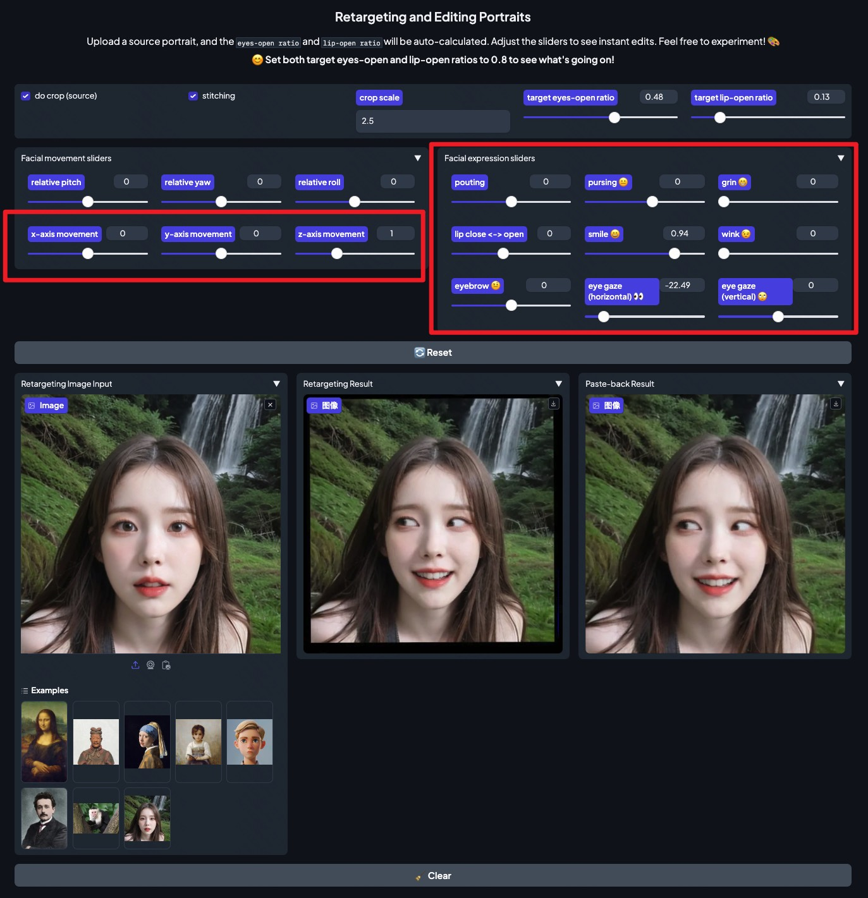

## Precise Portrait Editing

Inspired by [ComfyUI-AdvancedLivePortrait](https://github.com/PowerHouseMan/ComfyUI-AdvancedLivePortrait) ([@PowerHouseMan](https://github.com/PowerHouseMan)), we have implemented a version of Precise Portrait Editing in the Gradio interface. With each adjustment of the slider, the edited image updates in real-time. You can click the `🔄 Reset` button to reset all slider parameters. However, the performance may not be as fast as the ComfyUI plugin.

  
   
  Preciese Portrait Editing in the Gradio Interface

