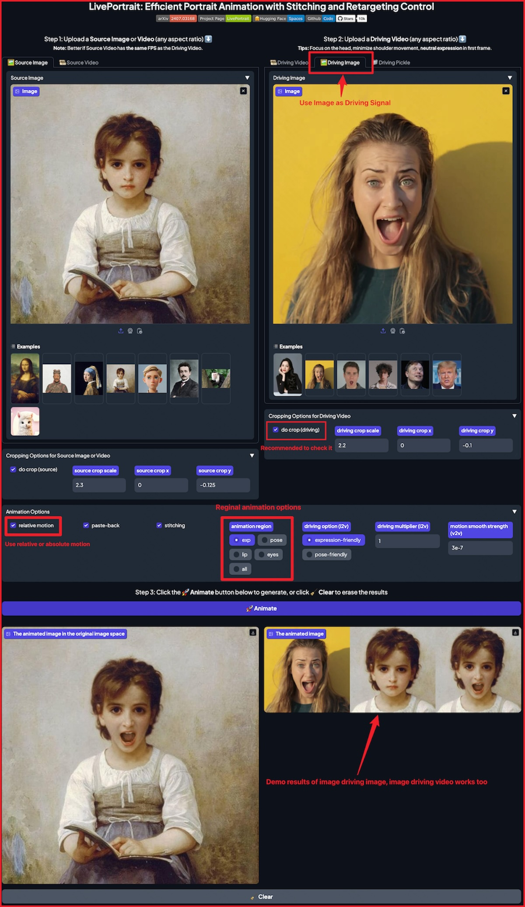
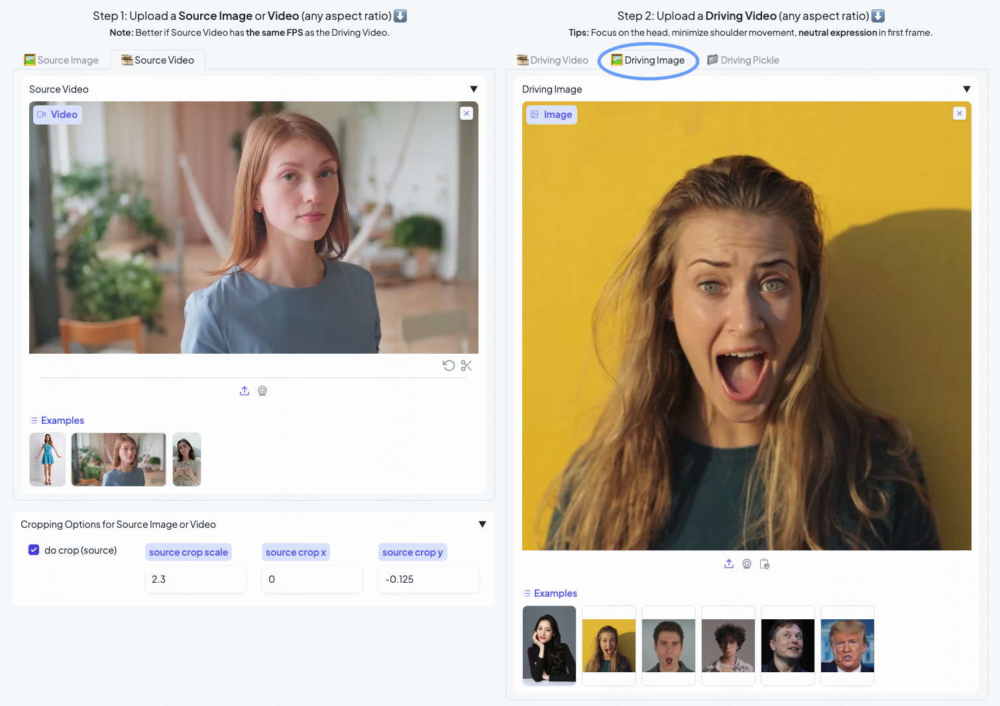
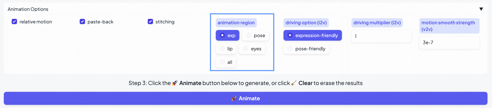

# Image-driven animation and regional animation mode

Inspired by [ComfyUI-AdvancedLivePortrait](https://github.com/PowerHouseMan/ComfyUI-AdvancedLivePortrait) ([@PowerHouseMan](https://github.com/PowerHouseMan)), we added the image-driven portrait animation and image-driven portrait video editing, as well as the regional animation mode. We also improved the absolute driving mode.

## Arguments Description

You can modify the argument options in `src/config/argument_config.py`. Below we explain the newly added arguments and the arguments that may confuse.

### Image-driven portrait animation and portrait video editing ###

- **driving**: You can set the image path of the driving option to your given driving image path as below:
```bash
python inference.py -d assets/examples/driving/d30.jpg
```
You can also upload the driving image to the corresponding location in the Gradio interface.
<p align="center">
  
  <br>
  Image-driven portrait animation
  <br><br>
  
  <br>
  Image-driven portrait video editing
</p>

- **flag_relative_motion**: If the driving input is an image and you set `flag_relative_motion` to true, then the driving motion will be the motion deformation between the driving image and its canonical image. If you set `flag_relative_motion` to false, the driving motion will be the absolute motion of the driving image, which may result in greater expression driving strength and a certain degree of identity leakage. `flag_relative_motion` corresponds to the `relative motion` option in the Gradio interface.

In addition, if both source input and driving input are images, the output will be an image. If source input is a video and driving input is an image, the animated result is a video, and the driving motion of each frame is provided by the driving image. In the Gradio interface, the output will be automatically saved in the corresponding format (image or video) and displayed in the corresponding window.

### Regional animation mode ###
- **animation_region**: This argument contains five options. The `exp` option means that only the expression part of the driving input is used to drive the source input, `pose` means that only the head pose part of the driving input is used to drive the source input, `lip` means that only the lip movement part of the driving input is used to drive the source input, `eyes` means that only the eye movement part of the driving input is used to drive the source input, and `all` means that all motions of the driving input are used to drive the source input. Alternatively, you can also select the corresponding option in the following area in the gradio interface.

<p align="center">
  
  <br>
  Regional animation mode
</p>

### Editing the lip region of the source video to the neutral expression ###
Some issues mentioned that in the `Retargeting Video` of the Gradio interface, it is hoped that not only the lips can be closed, but also the lip region of the source video can be edited into a neutral expression. Therefore, we provide a `keeping the lip silent` option. When you select this option, the lip region of the animated video will be the neutral expression. Since this uses a mode similar to absolute driving, this may cause inter-frame jitter or identity leakage in the animated video. Note that the neutral expression sometimes has a slightly open mouth.

### More explanation ###
When both the source input and the driving input are videos, some issues mentioned that the output motion is a mixture of the source video and the driving video motions. This is because the `flag_relative_motion` argument is enabled by default. In other words, we are using relative driving, not absolute driving. The difference between the two is that `flag_relative_motion` means that the motion offset of the current driving frame relative to the first driving frame will be added to the motion of the source frame as the final driving motion, while `no_flag_relative_motion` means that the motion of the current driving frame will be directly used as the final driving motion.

So if you want to keep only the motion of the driving video in the animated video, you can use:
```bash
python inference.py --no_flag_relative_motion
```
Or you can uncheck the `relative motion` option in the Gradio interface. Using absolute driving may cause jitter or identity leakage in the animated video.
